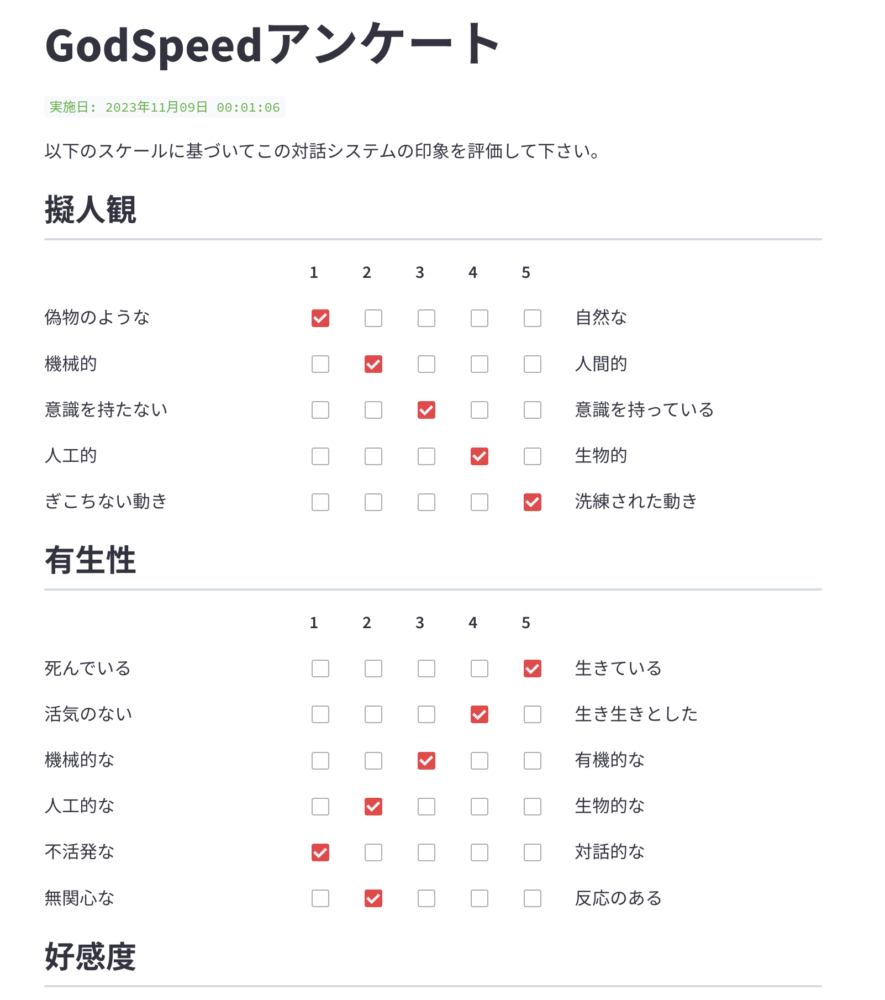
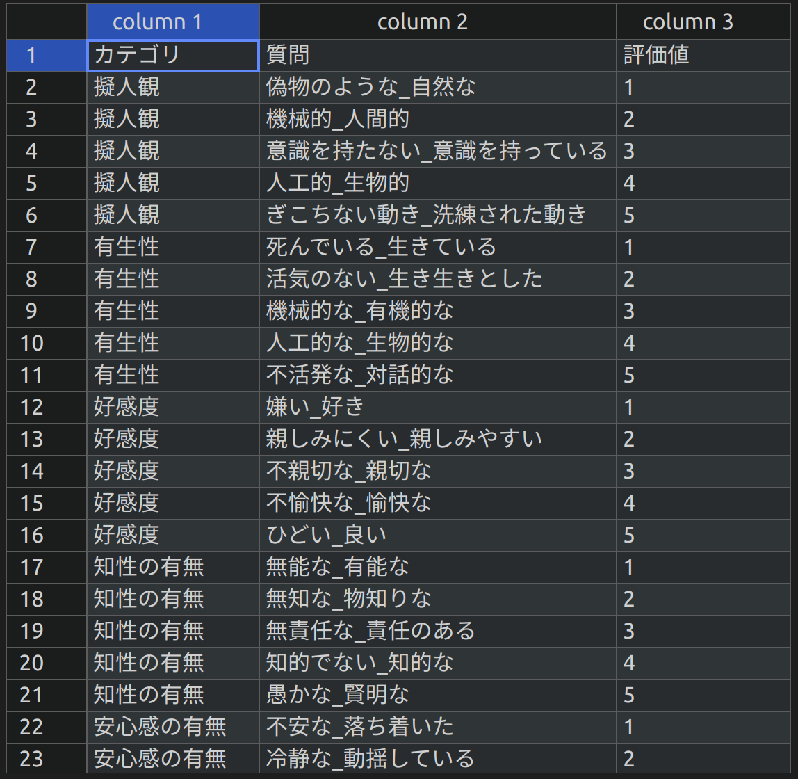
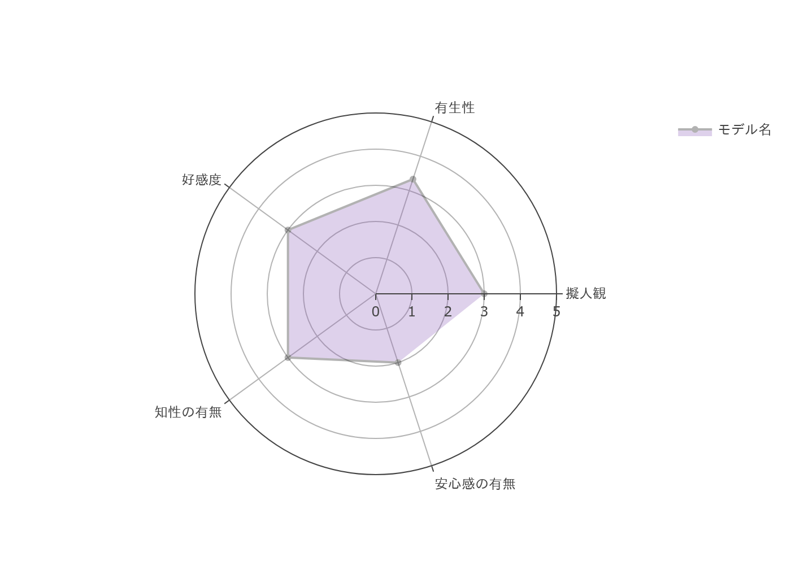

# ✨ 日本語版Godspeedアンケート
- Human Robot Interactionの分野で用いられるGodspeedアンケートの日本語版を作成しました。
- 実験などでご入り用の際にお使い下さい。
- ブラウザ上で動作するWebアプリケーションです。
- pythonのstreamlitライブラリを使用して実装しています。
- 翻訳はGodspeedアンケートの原著者であるBartneck氏の和訳から引用しています。

# 🖥️ 動作環境
- Ubuntu20.04
- Python3.8.10

# ⚙️ 環境構築
```
pip install -r requirements.txt
```

# ⚙️ 動作手順
```
streamlit run godspeed.py
```
- 下記の画面がブラウザで開かれます。
- 全ての質問に回答し```完了```ボタンをクリックします。


- 人間のロボットに対する代表的な５つの構成概念を軸にしたレーダーチャートがブラウザに表示されます。
- ```godspeed.py```と同じフォルダに```日付.csv```と```日付.png```が保存されていれば完了です。
- ```日付.csv```のログの例です。


- ```日付.png```のレーダーチャートの例です。


> **Warning**
> レーダーチャートについては試作として実装したものです。
> 各項目のサンプル数が異なる点、反転項目の検討を行っていない点等、留意事項がございますので使用にはご注意下さい。

# 📖 参考
## Godspeed Questionnaire Series: Translations and Usage
- https://www.bartneck.de/publications/2023/godspeed/bartneckGodspeedChapter2023.pdf